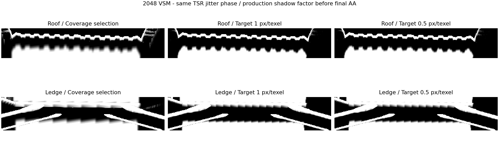

# 固定 2048：屏幕密度选层静态对照

2026-09-06，本地提交 d752ed61，VividRP_Reborn / Perf-Camera。

**结论：此视角开启 Screen Density 后，屋檐及横梁主体由第 5 层细化到第 4 层，主采样纹素的屏幕足迹约减半。目标从 1 降至 0.5 不再改善最终阴影，因为更细投影无法覆盖这些接收点。此轮可把 1 px/texel 作为后续测试候选，但没有证明已经达到 1 px 或消除锯齿。**

## 条件与方法

- 固定虚拟分辨率 2048、First Level=0、10 层、PCF 开启、Transition=0.2、LOD bias=0、Max Distance=150、256 个物理页。
- 相机位置 (0.0202028491, 7.662983, -2.4306047)，旋转 (359.226349, 3.03022361, 0.450279)，1920×1080。
- 保持用户修正后的 TSR Native AA；四组捕获的有效模式均为 TemporalSuperResolution。四组 jitter 均为 (-0.25, 0.166666687)，GPU VP 矩阵完全相同。
- 真实临时全局 Volume 依次覆盖：coverage → density1 → density05 → coverage-repeat。每组至少 120 个独立相机帧预热，随后等待相同 TSR 相位；捕获 cameraFrame=121/249/377/505。
- 从生产 Resolve 完成后的 EditorReceiverCapture 读取同帧深度、几何法线输入、阴影、页面表及计数器。诊断克隆只读，不写 feedback；生产路径实际采用对应 Volume 参数。
- 每组采集 mode 0/3/5/6，另存 allocator counters、page table 和 metadata。模式 5 的生产阴影通道用于对比图，它是最终 AA 之前的 shadow factor。

## 结果

| 策略 | 屋檐主采样足迹中位数 | 横梁主采样足迹中位数 | 请求页 | 驻留页 / 容量 | 缺页 / 回退 / 溢出 |
| --- | ---: | ---: | ---: | ---: | --- |
| Coverage | 5.353 px | 5.390 px | 79 | 79 / 256 | 0 / 0 / 0 |
| Density，目标 1 | 2.677 px | 2.695 px | 165 | 167 / 256 | 0 / 0 / 0 |
| Density，目标 0.5 | 2.677 px | 2.695 px | 165 | 167 / 256 | 0 / 0 / 0 |
| Coverage 回测 | 5.353 px | 5.390 px | 79 | 167 / 256 | 0 / 0 / 0 |

回测保留额外缓存驻留页，但请求已恢复；物理池容量没有变化。以上计数是捕获时的稳定状态，不能代替 GPU 耗时测量，也不保证相机移动期间没有瞬时缺页。

- 屋檐全部有效像素细化一级，横梁 98.625% 细化一级。屋檐世界纹素尺寸从 0.03125 降为 0.015625 世界单位。
- Density 1 的屋檐覆盖受限率 100%，横梁 97.840%；实际达到目标的像素分别为 0% 和 2.160%。Density 0.5 的两个 ROI 均 100% 受覆盖限制。
- Density 1 与 0.5 的整张 mode 5 完全一致，生产阴影最大差为 0；两个 ROI 的实际采样层和足迹也一致。全屏只有一个像素进一步细化，且阴影值未变。
- Coverage 前后回测的 mode 0/3/5/6 完全一致，最大差为 0。
- 所有捕获的诊断阴影与生产阴影最大差为 0.00048822，符合生产 R16 量化；没有缺页、实际层回退或 allocator 溢出。
- Density 下屋檐约 47% 像素还参与粗层过渡。足迹是主采样层的局部轴长度，不包含混合层贡献，也不是所有方向的严格上界；不能把足迹减半写成“锯齿减少 50%”。

## 范围与下一步

这是当前静止视角、1080p 输出、2048 VSM 的结果，不覆盖相机移动、其他距离或 4K 虚拟分辨率。此前 [4K 轨迹预算结论](../../VSMDensityFindings.md) 使用不同条件，仍然有效。

继续固定 2048 时，候选设置为 Screen Density=true、Target Texel Pixels=1、Resolution LOD Bias=0；继续减小 target 不能突破投影覆盖约束。下一项应验证移动时的页面预算与层间过渡，再评估受控纹素抖动与已有 TSR 的组合。此轮没有修改生产 Shader、默认参数或保存场景/Profile；临时 Volume 和捕获脚本已移除，已退出 Play 并恢复 runInBackground=false，用户的 AA 配置保持原值。

## 数据复核

- [机器可读统计](analysis-independent.json) 包含全屏及两个 ROI 的原始分布、覆盖限制和前后对照。
- [manifest.json](manifest.json) 记录完整原始文件的 SHA256、原始捕获目录和 ROI 范围。
- 每组子目录保存 frame.txt、4 个 uint 计数器、页面表/元数据及两个 ROI 的 mode0/3/5/6 无损 gzip。ROI 采用屏幕左上角原点，little-endian float32 RGBA：roof 为 70×380，ledge 为 80×390。
- 完整 1920×1080 RGBA32F 与最终游戏截图留在 C:/Users/11252/AppData/Local/Temp/vsm-density-probe/025152。首轮未对齐 TSR 相位的数据在相邻 024647 目录，结论采用本次对齐后的捕获。
- analyze-full-capture.py 是完整捕获分析脚本，需与上述完整 mode 文件放在同一目录运行。VSMDensityProbe.cs.txt 保存临时捕获源代码用于审查，不参与 Unity 编译。
- Unity Console 在清理后没有 Error。未修改运行时代码，未运行 Unity Test Framework。
