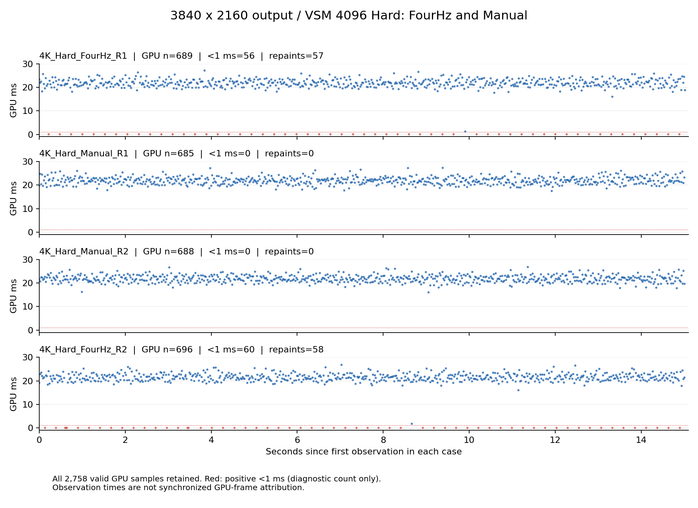

# 4K 实采：记录器重绘影响复核

本次实际 **3840×2160 Game 输出**的正反顺序对照支持：Manual 模式已隔离记录器自身周期重绘对整帧 GPU timing 的影响。两个 Manual 窗口均为零记录器重绘、零低于 1 ms 的正 GPU 读数；切回 FourHz 后，约 0.25 秒重复的低值重新出现。所有低值及连续低值簇均保留，以下统计没有数值过滤。

## 配置与采集

2026-09-06 01:29:18–01:30:58 UTC；Unity 6000.7.0a6，RTX 5070 Ti，D3D12，无 D3D12 debug 启动标志。VSM 4096、Hard、First Level=1、Max Distance=150、Transition=0.2，Screen Density 与屏幕空间降噪关闭。VSync=0、帧率上限=-1，要求 Frame Timings；每例预热 10 秒、测量至少 15 秒及 300 个样本。顺序为 **FourHz → Manual → Manual → FourHz**，包含逆序复核。

四例共用同一个临时管线/渲染图副本：移除 VSMReceiverDebugPass、SliderDebugPass、OverlayDebugPass，将 FinalBlit 输入接至 AntialiasingOutput，并重映射存留的 PassField 索引。原始资产未更改；[配置记录](capture-configuration.json) 保存了完整临时图及变更说明。由于管线是未保存的副本，`run.json.pipelineAsset` 为空。本次成本对应这个关闭诊断覆盖层的图，不能直接与此前 1920×1080 的记录或覆盖层开启时的成本比较。

采样期间未执行 Unity MCP 调用、UI 操作或截图，仅从磁盘查看完成状态。结束后已恢复原始当前/Quality 管线、1920×1080 Game 设置及原相机姿态，并退出 Play Mode；后台运行恢复关闭、Profiler 关闭、时间倍率为 1，临时对象已全部释放。

源码提交为 `ed3d4bcd384b92dca85041c65f9298f737e81ce1`。记录时 revision 标签保守地带有 `+working_tree_repaint_fix`；随后源码核验与 HEAD 一致，本轮未修改源码，补充来源清单保留具体文件校验信息。

## 原始分布与重绘

| Case | GPU 有效数/观察数 | 正 GPU <1 ms | 记录器重绘 | 低值间隔中位数 | GPU 中位数/P95（ms） |
|---|---:|---:|---:|---:|---:|
| FourHz R1 | 689/689 | 56（8.13%） | 57 | 0.2623 s | 21.550 / 24.466 |
| Manual R1 | 685/685 | 0（0%） | 0 | 不适用 | 21.871 / 24.614 |
| Manual R2 | 688/688 | 0（0%） | 0 | 不适用 | 21.713 / 24.507 |
| FourHz R2 | 696/696 | 60（8.62%） | 58 | 0.2583 s | 21.249 / 24.250 |

低值占比的分母为全部有效 GPU 样本。Manual 没有低值，因此不存在低值复现间隔，不能记为零秒。FourHz R1 的 56 个低值均为单个观察；FourHz R2 保留了 55 个单个低值、一个三连低值簇和一个二连低值簇。其低值簇起点间隔中位数为 0.2585 秒。0.258–0.262 秒与 0.25 秒重绘计划及约 21 ms 帧更新粒度一致，**这是调度量化解释的推断**，不是逐 GPU 帧归因。

| Case | Allocate 中位数/P95（ms） | ResolveAndFeedback 中位数/P95（ms） |
|---|---:|---:|
| FourHz R1 | 4.260 / 4.375 | 6.849 / 8.666 |
| Manual R1 | 4.259 / 4.374 | 6.877 / 8.696 |
| Manual R2 | 4.263 / 4.374 | 6.888 / 8.675 |
| FourHz R2 | 4.260 / 4.374 | 6.783 / 8.444 |

整帧低值模式随重绘开关消失、恢复，而主要 VSM 阶段成本接近，支持 timing 来源受重绘影响的解释；不能将两种模式的整帧中位数差异直接解释为 VSM 性能变化。

## 匹配与有效性检查

- 四例的请求设置（名称及重绘模式除外）、实际 VSM 分辨率/层数/容量、相机/灯光/场景/时间倍率完全一致。每例 start、end、segment-start 快照中的这些状态一致；跨例相应状态也一致，记录的引擎时间正常推进。像素与缩放后相机尺寸均为 3840×2160，动态分辨率关闭，单个启用的 Game 相机。
- 全部达到采样目标且 `timingCoveragePassed=true`；整帧 GPU、Allocate、Resolve 及必需阶段覆盖率为 100%。可选 InvalidateStatic、UnityCompatibilityRaster、ResetFeedback 无样本，保留缺失状态。
- 全部 `segments=1`，无暂停、重试、超过 100 ms 的帧间隔、相机移动、输出变化、设置不符、重复/回退/不可用 timing。各段原始累计重绘差与 case 重绘计数一致。
- 最终页计数全部为 `[188, 188, 0, 0]`（已分配/请求/新分配/溢出），无末帧溢出；这不是逐帧驻留统计。
- 直接从全部非空原始值重算 GPU、Allocate、Resolve 的有效数、中位数、最近秩 P95、最小/最大值，均与导出 JSON 相符。原始 CSV 和记录器报告未改写。

`completed_with_warnings` 的原因仅为整帧来源未归因，以及 FourHz 的保留低值诊断。四例仍为 `editor_frames_unattributed`、`comparable=false`、`qualityStatus=not_validated`：本次隔离的是**记录器自身的周期重绘贡献**，不保证其他 Editor UI 没有影响，也不能把延迟 GPU timing 与某个相机帧或 Present 一一对应。

四例均未记录 case 错误，但 Unity Console 并非全局无错误。恢复设置后，Console 显示 GPUMeshletCulling、HZBGenerate、ColorPyramid 三项既有 UAV 数量限制错误（14 > 8）；显示的最近发生时间为 09:31:45 本地时间，晚于采集结束的 09:30:58.97。这不证明采集期间或整个管线均无问题，本报告不认证管线整体正确性。

## 可复核材料

- [独立匹配审计](matched-audit.json)、[源码与原始采集 SHA256 清单](provenance.json)、[恢复状态核验](restoration.json)、[恢复后的 Console 记录](console-after-restoration.json)。
- [记录器完整报告](20260906_012918_a2e64af2/report.md)、[运行元数据](20260906_012918_a2e64af2/run.json)、[全部指标汇总](20260906_012918_a2e64af2/summary.csv)、[事件记录](20260906_012918_a2e64af2/events.jsonl)、[标准 timing 审计](20260906_012918_a2e64af2/timing-source-audit.json)。
- 原始 CSV：[FourHz R1](20260906_012918_a2e64af2/case_000_samples.csv)、[Manual R1](20260906_012918_a2e64af2/case_001_samples.csv)、[Manual R2](20260906_012918_a2e64af2/case_002_samples.csv)、[FourHz R2](20260906_012918_a2e64af2/case_003_samples.csv)。
- 后续复采继续采用相同输出、场景与渲染图，固定其他控制项并重复正反顺序。比较全部分布、低值计数/有效数、段内间隔、重绘数、阶段成本与覆盖率；不要删除低读数、截断到 1 ms 或用过滤后的统计替换标题值。若匹配失败，应保留该次记录并补采。
