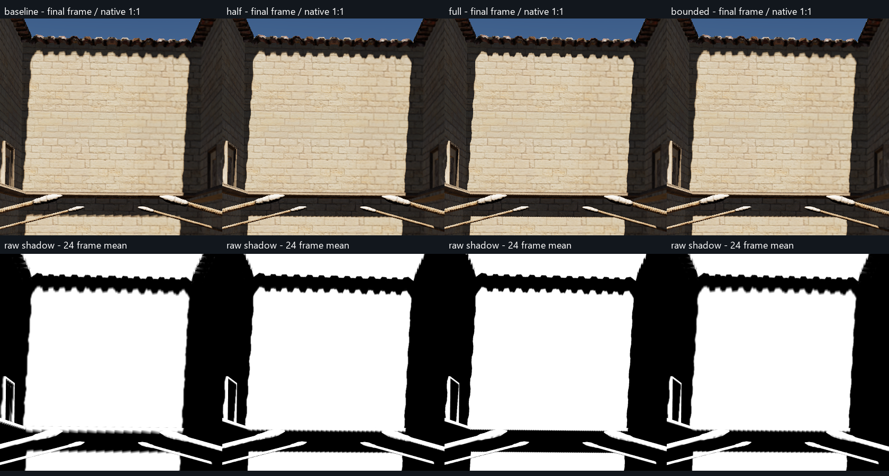
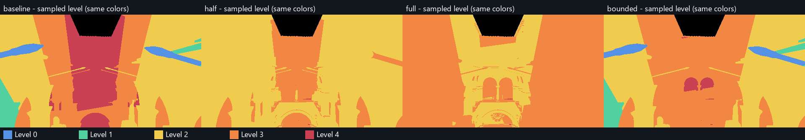

# 固定 2048：细层覆盖实验

实验日期：2026-09-07。基线：`7cfe2d13`（area PCF）。项目：`E:/VividRP_Reborn`。

结论：细层覆盖确实限制了远墙阴影，但整体前移细层会超出 256 页预算。只前移第 3 层、同时保住原第 2 层的受限方案，能在本次路径中保持零溢出并改善横梁覆盖；屋檐仍被约 95% 的粗层混合权重主导，尚不能作为阴影锯齿已经解决的证据。正式代码及场景设置已恢复，保留实验源码、数据与对照图，未默认启用候选布局。

## 固定条件与方法

- 虚拟分辨率 **2048**，物理池 **256 页**，每页 128²；没有增加物理池。
- FirstLevel=0，ScreenDensity=true，target=1 pixel，LODbias=0，PCF=true，stochastic=false，transition=0.2。area PCF、偏移处理和页边界完整采样策略保持现状。
- Native 1920×1080，TSR NativeAA，history=16，原 sharpening=0.483。临时固定曝光 EV100=12.252064，以免自动曝光干扰对照；结束恢复。
- 原相机 `(0.0202028491, 7.662983, -2.4306047)`，FOV 60。原相机、光照、AA、时间及运行状态均由诊断器保存并还原。
- 初始画面中央 20%×20% 的可见接收面 GPU 世界坐标，沿相机 forward 的深度中位数 **10.6620922 m**；5184 个有效样本，p20=10.1490135，p80=10.7529631。只在实验开始标定一次，不能称为已经实现了动态接收面聚焦系统。
- 每个候选测量静止 24 帧、平移 64 帧、转头 96 帧；每段至少预热 128 帧，首帧 jitter 对齐。共 **736 个测量帧 + 4 个标定帧**。
- 平移：48 帧沿世界 `(1.5,0,1.5)` 米向量正弦往返，随后静止 16 帧；转头：64 帧世界 Y 轴 ±12° 正弦往返，随后静止 32 帧。四组相机轨迹与 jitter 在所有成对诊断帧一致。
- 每帧记录页计数、运行状态与设置；静态每帧、动态每四帧及末帧捕获原生 ROI 和全屏 480×270 诊断网格。网格是在原生图像每 4×4 区域取一个准确像素，并非模糊后的缩略图。另有原生全帧 PNG。

四组布局：

1. **baseline**：现有相机中心布局。
2. **half**：0–3 层向标定目标前移半幅，4 层及以上保持不动。
3. **full**：0–3 层向目标前移全幅，4 层及以上保持不动。
4. **bounded**：仅前移第 3 层，0–2 和 4+ 层完全不动；第 3 层须包含原第 2 层，并被第 4 层包含。

所有移动都按世界页网格对齐，子层在父层内留一子页边界，移动窗口有四分之一页迟滞。实际相机位置仍用于距离选取；光空间深度基准和二次幂层半径均不改。实验通过一个 Editor-only 页原点回调接入，玩家路径未改变。

## 结果

表中脚印是**主采样层**的屏幕脚印中位数，不代表混合后的有效阴影分辨率。ROI：屋檐 `(735,190,380,70)`；横梁 `(715,485,390,80)`。

| 布局 | 屋檐主采样脚印 | 横梁主采样脚印 | 全路径请求峰值 / 256 | 溢出峰值 | 静态全屏比基线变粗的网格点 |
|---|---:|---:|---:|---:|---:|
| baseline | 2.677 px | 2.694 px | 178 | 0 | — |
| half | 1.338 px | 1.347 px | 442 | 186 | 8184 / 124497 |
| full | 1.338 px | 0.676 px | 481 | 225 | 66354 / 124497 |
| bounded | 1.339 px | 1.348 px | 216 | 0 | 0 / 124497 |

`half` 和 `full` 在静止时已分别请求至 359 和 450 页，不能直接采用。full 的初始近处接收面主要从第 2 层退到第 3 层，存在明确取舍，不是全局质量提升。

`bounded` 的静态驻留页为 205，基线为 167；动态驻留峰值达到 **256**（基线 246），尽管请求峰值只有 216。这反映了滚动缓存的占用，不能将 40 页差值解释为稳定的缓存余量。本次路径零溢出，不足以保证长路径、其它相机或视野下也不会溢出。

bounded 静态全屏约 21616 / 124497 个有效网格点采到更细层，零点变粗；77,315 个初始近处样本的选层及脚印与基线一致。转头捕获帧无新增变粗样本；平移捕获帧最多有 152 点比对应基线粗，约占有效点的 0.12%。没有观察到基线可采样、候选却完全无可采样层的新增网格点。





### 为什么 bounded 的屋檐仍然软、粗

屋檐 1330 个有效网格点中，1293 个主采样层已从 4 降至 3。然而它们处在第 3 层的覆盖过渡带内：

- 屋檐整体粗层混合权重中位数为 **0.9461**。
- 仅看主层=3、且有过渡样本的点，粗层权重中位数为 **0.9515**，p95=0.9979。
- 这使最终屋檐仍主要使用第 4 层，不能只凭 debug 主层变色或 1.34 px 脚印宣称质量翻倍。
- 横梁 ROI 的粗层权重中位数为 0，主层大多为第 3 层，覆盖收益实际进入了最终阴影。

当前 `SelectVSMDensityLevel` 先以包含 normal offset 和 PCF guard 的 UV 判定覆盖，再用 `VSMTransitionWeight(edge + guard, parameters.z)` 混合更粗层。这是后续应直接对照的控制点；安全采样边界与质量过渡带需要分别评估。

静态最终 TSR 输出在基线阴影边缘掩码上的时间 RMS：

| ROI | baseline | bounded | 变化 |
|---|---:|---:|---:|
| 屋檐 | 0.0305751 | 0.0305906 | +0.05% |
| 横梁 | 0.0935838 | 0.0944391 | +0.91% |

没有测得时间稳定性改善。这些数值受 jitter、几何边缘和历史处理影响，不能当作阴影精度或有无拖影的真值指标；本次主要确定覆盖、混合和预算之间的关系。

### 动态缺页与验证界限

所有测量帧均为 VSM Active，无整帧 CSM fallback。基线平移本身存在细层读取未命中：诊断网格单帧最多 18658 点触发 missing 标记，bounded 为 18662；转头两者均为 108。标记表示采样链遇到缺页，仍可由粗层接住，不等于该像素漏光。不要将“零溢出”写成“零缺页”。

GPU 诊断重放与生产阴影的最大绝对差值为 0.0005493164，约在半精度输出量级。未做光追真值对照、长路径 GPU 性能测量或帧率结论；诊断 readback、压缩和截图有明显开销。

## 下一步

建议采用 **bounded 作为下一轮的布局基线**，先比较覆盖过渡带宽度/权重，而不是继续整体前移 0–3 层：

1. 保留 PCF 完整脚印 guard、normal offset 和缺页整层 fallback；对照更窄的覆盖过渡带，记录屋檐真正的细层贡献，而不只记录 sampled level。
2. 使用相同静止、平移和转头路径，检查页边界跳变、原始阴影与 TSR 输出。若减少粗层混合引入跳变，则扩大细层的有效内部覆盖，不能仅删除混合。
3. 正式采用前补做长路径/更大转角页面预算检查，并记录每层请求及驻留开销。当前动态缓存已经填满，不能继续盲目扩展覆盖。

上述是下一轮建议，本次没有修改 transition、滤波或 TSR，也没有提交自动聚焦或预算调度功能。

## 验证、归档与复现

- Runtime、Editor、Editor.Tests 使用 Unity Bee response file 和 Roslyn 编译通过，引用使用同轮重建的依赖；两次实验代码版本分别保存在 `validation/csharp` 和 `validation/csharp-bounded`。
- 新诊断 ComputeShader 使用 DXC `cs_6_2`、D3D11 defines、native16 编译通过，并在真实场景执行 GPU 采集。生产 Shader 未修改。
- 两组诊断各做 400 个相机位置布局检查：深度基准、距离选取、未移动层矩阵、父子包含、页网格对齐通过。预热 100 次后，1000 次稳定布局 Update 的 `GC.GetAllocatedBytesForCurrentThread()` 差值为 0；只覆盖调用线程，不能替代全线程 Profiler，也不是对带 readback 的采集器作零分配承诺。
- 按仓库规则，交互式 Unity Editor 开启期间未运行 Unity Test Framework。本次未保留新的运行时逻辑或测试夹具。
- 正式布局文件恢复到基线字节；临时 Editor 资产及其 meta 已移除。探针的 Dispose 恢复相机、光照、临时 Volume、时间参数及后台运行状态，并退出本次 Play 会话。

保留文件：

- `VSMCoverageProbe.initial.cs.txt`：三组完整对照探针。
- `VSMCoverageProbe.bounded.cs.txt`：受限方案补测探针。
- `VSMCoverageAudit.compute.txt`：全屏抽样诊断及标定 kernel。
- `layout-hook.patch`：仅供复现实验的 8 行 Editor 布局挂钩；不在正式路径启用。
- `analyze_coverage.py`、`results/summary.json`：分析脚本和完整结构化统计。
- `evidence/initial`、`evidence/bounded`：逐帧 metadata、标定、设置、Shader hash 与完成状态。
- `source-manifest.json`、`validation`：源版本与编译证据。

原始 GPU readback 与全帧 PNG 保存在本地忽略目录：

- `E:/VividRP_Reborn/Packages/VividRP/Temp~/vsm-coverage/20260907_135140_148`
- `E:/VividRP_Reborn/Packages/VividRP/Temp~/vsm-coverage/20260907_135705_809`

分析复现命令（仓库根目录）：

```powershell
python 'Roadmap~/Experiments/VSMCoverage2048_20260907/analyze_coverage.py' 'Temp~/vsm-coverage/20260907_135140_148' --bounded 'Temp~/vsm-coverage/20260907_135705_809' --out 'Roadmap~/Experiments/VSMCoverage2048_20260907/results'
```

重新采集时，在本项目应用 `layout-hook.patch`，把对应探针与 ComputeShader 从 `.txt` 复制回 `Editor/Tools` 下的原文件名，让 Unity 自动生成 meta。进入 Play Mode 后执行 `Tools/VividRP/Diagnostics/Capture Temporary VSM Coverage`。初始探针测 calibration+baseline/half/full；bounded 探针只测 calibration+bounded，沿用相同基线。采集期间勿刷新资产或触发 domain reload。结束后按原探针 Dispose 和本次还原流程清理；这些文本不是自动启用的产品功能。
