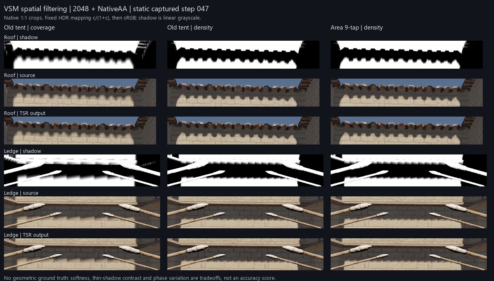

# 固定 2048：密度选层落地与 9 次比较面积滤波

2026-09-07，基于 `8e8146be`，VividRP_Reborn / Camera_1。

**已保存日间 Profile 的 Screen Density=true，并将默认 VSM PCF 改为面积滤波。** 屋檐主采样纹素从约 5.35 个屏幕像素细化到 2.67。面积滤波对残余栅格感提供小幅改善，保留最多 9 次比较。960 帧对照没有发现新增页面溢出或灯光响应延迟；它没有消除固定 2048 下的所有锯齿。

## 实际修改

- `Shaders/Core/Private/CSMShadowResolve.compute`：将 sampled tent 权重改为 `saturate(1.5-abs(offset))`，即接收点中心宽度为两个阴影纹素的 box 与单位纹素格的精确重叠面积。每轴三个权重归一化后为 `(.25-.5f, .5, .25+.5f)`，`f ∈ [-.5,.5]`。
- 保留 ±1 tap 支持范围、最多 9 次深度比较、原页面请求/边界保护、逐实际纹素中心的接收面深度修正及完整 footprint 回退。硬阴影、随机滤波和 TSR 算法均未改动。Runtime C# 仅修改两个说明字段，没有新增渲染循环分配或 GPU 资源。
- 已通过 Unity API 保存 `E:/VividRP_Reborn/Assets/ClassicSponza/Profiles/Post Processing Profile - Day.asset`。初始序列化数据和实际 Volume 栈均为 Screen Density=false，最终均为 true。这一场景资产位于 package Git 仓库之外，差异另存 [scene-profile.patch](scene-profile.patch)。Unity 同时补写已有随机滤波字段的默认 false 值。
- 2048、target=1、LOD bias=0、transition=.2、PCF=true、stochastic=false。保留用户的 TSR NativeAA、16 history samples、sharpness=.483。最终已退出 Play，恢复相机、灯光、时间和后台运行状态，临时 Volume/诊断脚本均已清理。

## 场景对照

原生 1920×1080。相机位置 `(0.02020285, 7.662983, -2.430605)`，FOV=60。原滤波 coverage/density 各 static48 + camera96 + light176，合计640帧；面积候选只录最终采用的 density 三场景320帧。每阶段预热至少128帧、首 jitter 对齐，相同相机/灯光轨迹、曝光、偏移和 AA。320 对旧/新 density 帧均通过这些字段配对检查。

| 指标 | 旧 coverage | 旧 density | 面积 density |
|---|---:|---:|---:|
| 屋檐主采样纹素足迹中位数 | 5.345 px | 2.673 px | 2.673 px |
| 横梁主采样纹素足迹中位数 | 5.398 px | 2.699 px | 2.699 px |
| 静止驻留页 | 79/256 | 167/256 | 167/256 |
| 相机轨迹驻留页峰值 | 86/256 | 181/256 | 181/256 |
| 灯光轨迹驻留页峰值 | 86/256 | 173/256 | 173/256 |

所有有 receiver snapshot 的帧，ROI 缺页为0；全部帧 allocator overflow为0。灯光改变的第16/96帧，旧/新实现都因 ReceiverFeedbackUnavailable 进入已有的一帧 CSM fallback，此时没有 VSM debug snapshot；不能把这两帧写成成功的 VSM 无缺页验证。生产阴影与 debug replay 最大误差为0.00048822，与R16量化一致。

图中的阴影为线性灰度；source/TSR output 采用统一 `c/(1+c)` 后转sRGB展示，不是游戏最终调色。所有像素来自 GPU 捕获，无放大插值或补绘。原生最终游戏 PNG 留在原始捕获各 stage 的 first/last.png。

## 收益与限制

面积滤波在17×17相位的GPU测试中，把横/纵交替明暗纹素原先约.5～.6、棋盘格约.48～.5的响应稳定到.5。这个结果证明对该频率的抗混叠能力，不代表真实几何精度。

相同 density 下，固定基线共同阴影边缘 mask 的48帧最终颜色亮度 RMS：屋檐 `.025809→.025196`（-2.38%），横梁 `.084415→.084348`（-0.08%）。去除 jitter 相位均值后的横梁残余略升 `.001703→.001779`（+4.49%）；屋檐略降。整体收益较小，没有证据支持“全面减少闪烁”。密度细化后的屋檐比原先模糊的 coverage 更锐，整体时间 RMS 仍高约8.12%；足迹减半也不能解释为锯齿减少50%。

薄结构是明确的代价：在纹素中心，单纹素宽阴影的中心权重由.6降到.5，孤立二维纹素由.36降到.25。这里保留面积滤波，因为它消除采样相位引入的非均匀响应，实际画面改善温和，且未增加比较数或动态响应延迟。

屋檐实际最低覆盖层仍为4，desired LOD中位约2.58；更细层覆盖不到接收点。因此继续降低 target 无法得到1 px纹素。后续较大的空间质量收益应从细层投影的覆盖布局入手；单纯增大核会进一步损失细小阴影的对比度。

## 动态 TSR 验证

相机先平移再停下；灯光第16帧旋转local X +2°、第96帧恢复。以同一实现、同 jitter 相位的已收敛输出为响应目标，仅评估历史跟随速度，不将它作为几何真值。

在旧滤波定义的固定光照变化 mask 上，误差降至变化幅度10%以下并连续保持8帧：屋檐正向18帧/反向9帧，横梁正向9帧/反向6帧，旧/新一致。相机停止后前8帧的最终颜色残余RMS：屋檐 `.008070→.007880`，横梁 `.042049→.042093`，没有显示显著动态回退。这里的阈值/mask与上一轮TSR历史报告不同，帧数不能直接跨报告比较。

[动态数据与定义](analysis/dynamic-response.json)；[灯光变化第21帧](analysis/native_light_step_021.png)；[相机停止后的第95帧](analysis/native_camera_095.png)。

## 验证与复现

- GPU独立诊断：旧45绿/5预期红，新50/50通过，每轮13,874个float2；硬/随机相关10,693个值逐值完全一致。包括常量保持、跨页相位、coplanar/近遮挡、missing/dirty完整回退。见 [gpu-report.json](gpu-report.json) 和完整 [gpu-values.json](gpu-values.json)。
- DXC：22个生产入口+13个采样/receiver测试入口，35/35通过，保留pragma自带defines。见 [编译记录](validation-area-initial/shaders/dxc-validation.json)。二进制位于ignored Temp~，位置映射见同目录artifact-relocation.json。
- Roslyn：清理临时脚本后的 Runtime/Editor/Editor.Tests 全通过，源码和Bee响应在检查期间稳定。见 [C#记录](validation-csharp-final/csharp-validation.json)。最终 Unity 错误日志为0条。
- Editor一直开着，未运行Unity Test Framework。请手动运行 `VirtualShadowMapSamplingTests`；它包含新增相位、接收平面/遮挡、缺页测试。
- 原始捕获：`Temp~/vsm-spatial-aa/20260907_125631_834`（旧640）、`Temp~/vsm-spatial-aa/20260907_130637_770`（面积320）。各自附初始配置和shader SHA清单。采集包含GPU回读、压缩等诊断开销，不能用于GPU耗时结论。
- [analyze_spatial_aa.py](analyze_spatial_aa.py) 可用 `--baseline <旧目录> --candidate <新目录> --output <输出目录>` 重算。动态响应脚本、探针源代码以文本归档；GPU/场景分析不调用Unity测试运行器。

