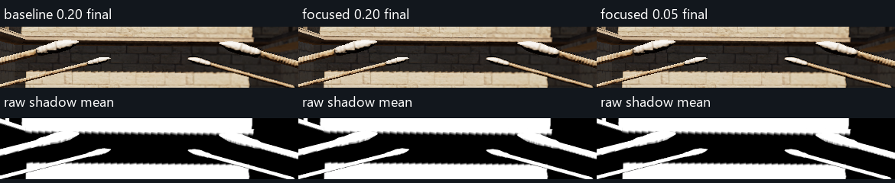
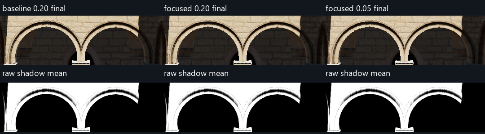

# 4096：覆盖过渡带对照

日期：2026-09-07。项目：`E:/VividRP_Reborn`。代码基线：`7cfe2d13`。用户提供的性能参考为 GPU 7.3 ms；本次不把带 readback 的采集时间当作 GPU 性能测量。

**结论：不采用窄过渡作为当前伪影的修复。** 对现有布局测试了 0.2、0.1、0.05、0.02；随后在相同空页池初始条件下，复核现有布局和受限第 3 层布局各自的 0.2 / 0.05。目标阴影没有获得实质收益。当前需要先让更细的覆盖区域真正取得物理页，而不是继续缩小过渡参数。

生产代码、相机、光照、AA 和场景设置均已恢复。用户的 **4096** 虚拟分辨率保留，原 transition=0.2；本次只归档实验与证据。

## 最终受控结果

最终证据是 `controlled-results`，不是前面的探索性采集。每段从空物理页池开始，预热至少 128 帧，首帧 jitter 对齐。静态 32 帧、转头 128 帧，四组共 640 帧，再加原布局 0.2 的 32 帧 A/A 重复，合计 **672 个测量帧**。

| 布局与覆盖宽度 | 静态请求峰值 | 转头请求峰值 | 转头溢出峰值 | 对目标区域的结果 |
|---|---:|---:|---:|---|
| 原布局，0.2 | 421 | 438 | 182 | 基线 |
| 原布局，0.05 | 421 | 438 | 182 | 屋檐、拱门原始阴影逐像素相同；横梁变化很小 |
| 受限第 3 层，0.2 | 504 | 528 | 272 | 更细的覆盖未转化为目标处的有效采样 |
| 受限第 3 层，0.05 | 504 | 528 | 272 | 相对受限 0.2，三个目标 ROI 的原始阴影逐像素相同 |

宽窄两档在各自相同布局下，所有捕获帧的有效物理页集合完全相同；首选层、实际采样层也相同。原参数重复采集的驻留集合也完全相同。相机位置、转角和 jitter 成对匹配。

原布局 0.2 → 0.05 的横梁变化，按基线阴影边缘掩码统计，原始阴影 MAE=0.0003701；按完整横梁 ROI，单帧最大 MAE=0.0001244，超过 1/1024 的变化像素最多约 0.79%。对照图中的主要阶梯形边缘仍然存在，不能将这点变化解释为已解决锯齿。





## 限制在哪里

### 1. 当前目标边缘大多不在有效覆盖混合中

原布局中，屋檐的覆盖混合权重为零，拱门也基本为零；主要阴影依然在第 4 层，脚印中位数约 1.34 屏幕像素。缩小覆盖过渡带不会扩大第 3 层窗口，也不能让它覆盖原来覆盖不到的接收面。

上一轮 2048 实验中“屋檐粗层混合约 95%”来自**受限前移布局**。该数值不适用于本轮开始时用户使用的相机中心布局。此次把这两种情况分别测量，避免将不同布局的诊断混用。

### 2. 调整覆盖以后，页分配又限制了收益

物理池始终是 256 页。以下是最终受控采集的静态第 0 帧，来自 page table 和 metadata，需求是该帧分配器消费的反馈快照：

| 层级 | 原布局请求 | 受限布局请求 | 两者有效驻留 |
|---|---:|---:|---:|
| 0–2 合计 | 147 | 147 | 0 |
| 3 | 122 | 204 | 106 |
| 4–9 合计 | 150 | 150 | 150 |
| 合计 | 419 | 501 | 256 |

这些是某一个捕获帧，因 jitter 引起的边界需求变化，静态峰值分别是 421、504。

当前 `ResolveVSMReceiver` 会请求完整回退链；`VSMPrototypeAllocatePages` 从粗到细分配，并保护已经驻留、仍有请求的同级或更粗级页面。在本视角下，粗层先占了 150 页，第 3 层只剩 106 页；第 0–2 层没有取得有效驻留。

因此，受限前移虽然让目标接收面具备更细层覆盖，目标所需的细页仍可能不存在，实际继续由第 4 层采样。缩窄覆盖混合不能补出缺失的深度数据。完整脚印失败后的整层回退保持正确，避免把缺页当作亮面；但它不能凭空恢复细节。

这不等于“每一条可见锯齿都由缺页直接造成”。原布局目标区域首先受细层窗口覆盖和采样密度限制；预算问题是让细层覆盖改动产生收益时遇到的下一道限制。几何轮廓和 TSR 重建的贡献也没有被本实验全部隔离。

## 为何加入空页池控制和 A/A

先做了三段探索：现有布局四档、受限布局两档、原参数重复。探索过程中，宽窄两档的实际采样层曾出现差别，但请求数并未改变。

源码与读回结果表明，满载页池会保护同级驻留请求；上一条相机路径留下的页集合可能长期保留。仅重置 TSR、等待 128 帧，并不能保证两组 VSM 驻留集合相同。**此前探索中“窄过渡让更多区域采到第 3 层”的现象不能归因于过渡宽度。**

最终每段在旧 readback 完成后调用 `ReleaseResources()`，从空页池重新建立相同布局，再预热并对齐 jitter；捕获 page table 与 metadata，对比非空、owner 一致且非 Dirty 的有效映射集合。这样排除了驻留历史的混杂。

同时，原布局 0.2 的 A/A 重复显示：原始阴影和进入 TSR 的 source 在三个 ROI 中均逐像素相同，TSR 输出仍有小差异。下表为静态阴影边缘掩码上的输出 MAE，仅用于对照变化量：

| ROI | 0.2 → 0.05 | 原参数 A/A |
|---|---:|---:|
| 屋檐 | 0.001134 | 0.001160 |
| 横梁 | 0.000709 | 0.000690 |
| 拱门 | 0.001731 | 0.001772 |

参数变化与 A/A 的输出差异量级接近，没有证据将其视为过渡宽度带来的画质改善。未进一步定位这部分 TSR 差异的来源，也不据此宣称新的 TSR 缺陷。

## 动态验证与边界

受控转头路径：前 96 帧绕世界 Y 轴按正弦往返 ±12°，后 32 帧回到原姿态静止。每帧计数和状态，动态每四帧及末帧读回图像；没有声称排除所有未采样帧的瞬时跳变。

- 所有 672 帧均为 VSM Active，无整帧 CSM fallback。
- 同布局宽窄两档，在所有成对捕获帧上均无新增主采样层变粗/变细，无新增完全不可采样点；有效页面集合完全相同。
- 这不是零缺页：池超量始终存在，VSM 内部继续使用粗层回退。`missing` 诊断标志不等于该像素漏光。
- 停止转头后的输出恢复曲线几乎重合。例如横梁相对同参数静态、同 jitter 参考的 RMS：停止当帧 0.12178 / 0.12180，第 16 帧 0.01671 / 0.01669，第 31 帧 0.00425 / 0.00417（原布局 0.2 / 0.05）。没有恢复速度改善的证据。
- GPU 诊断重放与生产半精度阴影最大绝对差约 0.00048816。
- 未进行光追真值比较或无 readback 的 GPU timing。7.3 ms 仍是用户提供的测量值；本次不能给出某一窄过渡参数节省多少毫秒的结论。

前面的探索还包含约 2.1 米往返平移，但因驻留状态未统一，主要用于暴露问题和检查流程，不作为宽窄参数的最终因果证据。

## 下一步建议

保持 4096，先处理**页面请求与分配优先级**，再回到受限覆盖和过渡带：

1. 用本轮按层的需求/驻留统计建立预算检查，确保目标主采样页能取得预算。
2. 区分接收面主采样、确实需要的过渡层、以及兜底回退需求；研究当前“完整回退链从粗到细保护”是否可以改成有明确保底的分配，而不是让所有中间粗层先耗尽预算。
3. 保留完整 PCF 脚印检查、owner/Dirty 校验和安全回退；任何分配调整都需验证缺页、相机运动与过渡，不应靠把缺页视为已照亮来提升表面质量。
4. 在有效细层驻留得到保证后，再比较受限覆盖与 0.2 / 0.05；最后用无 readback 的 GPU 测量检查是否守住用户约 7.3 ms 的边界。

这些是下一轮实现方向。本轮没有修改分配策略、增加物理池或默认启用新的过渡宽度。

## 设置、验证与复现

固定条件：VSM 4096、页大小 128、池容量 256、FirstLevel=0、ScreenDensity=true、target=1、LODbias=0、PCF=true、stochastic=false。Native 1920×1080，TSR NativeAA，history=16，sharpening=0.483。临时固定 EV100=12.252064；退出恢复原 Volume。实际相机 `(0.0202028491,7.662983,-2.4306047)`，FOV 60。

实验只缩放 `SelectVSMDensityLevel` 的**覆盖**混合宽度；基于小数 LOD 的混合仍为 0.2。完整 PCF guard、normal offset 和整层回退均未改。受限布局只移动第 3 层，包含原第 2 层、位于第 4 层内，世界页网格对齐，保留一子页边界及四分之一页迟滞。目标深度由初始中央 20%×20% 接收面标定约 10.662 m；不代表已实现通用动态聚焦系统。

- Runtime、Editor、Editor.Tests 的 Roslyn 编译通过；使用同轮重建依赖。
- 35 个相关生产/采样测试 Shader kernel 和新诊断 kernel 的 DXC 编译通过；诊断 kernel 在真实场景执行。
- 400 个布局位置检查通过；预热后的 1000 次布局更新及 10000 次 receiver 参数构造均在调用线程测得 0 字节托管分配。这不代表带 readback 的采集器零分配，也不是全线程 Profiler 结论。
- 按仓库约束未在开启的 Unity Editor 中运行 Unity Test Framework；未留下新的测试夹具或运行时功能。
- 三个生产文件已恢复到基线字节，临时 Editor 资产及对应 meta 已移除；相机、AA、光照和 4096 Volume 设置恢复核对见 `validation/restoration.json`。

文件导航：

- **最终结论**：`controlled-results/summary.json` 及该目录对照图。
- **探索记录，有驻留历史混杂**：`exploratory-results`；`results` 是同轮探索性分析输出，不替代最终受控结果。
- 探针源码：`VSMTransitionProbe.current-layout.cs.txt`、`VSMTransitionProbe.focused-exploratory.cs.txt`、`VSMTransitionProbe.controlled.cs.txt`。
- 实验 Shader：`VSMTransitionAudit.compute.txt`；生产文件的临时改动见 `experimental-changes.patch`。
- `evidence`：三次采集的逐帧设置与状态、标定、完成标记和 Shader hash。
- `validation`、`source-manifest.json`：编译与源版本证据。

原始读回在本地忽略目录 `E:/VividRP_Reborn/Packages/VividRP/Temp~/vsm-transition/` 下：

- `20260907_141914_047`：现有布局四档，1024 测量帧。
- `20260907_143452_300`：探索性受限布局与 A/A，544 测量帧。
- **`20260907_144429_196`：空页池受控确认，672 测量帧。**

三次另有 6 个标定帧；探索与受控测量共 2240 帧。

最终分析复现：

```powershell
python 'Roadmap~/Experiments/VSMTransition4096_20260907/analyze_transition.py' 'Temp~/vsm-transition/20260907_144429_196' --controlled --out 'Roadmap~/Experiments/VSMTransition4096_20260907/controlled-results'
```

重新采集时应用实验 patch，将相应探针和 audit 文件复制回 `Editor/Tools` 的原文件名，让 Unity 自动生成 meta；编译通过后在本项目 Play Mode 执行 `Tools/VividRP/Diagnostics/Capture Temporary VSM Transition`。最终判断应使用 controlled 探针，确保同宽窄对照的有效页集合一致。捕获期间不得刷新脚本或触发 domain reload；结束后恢复临时改动。
