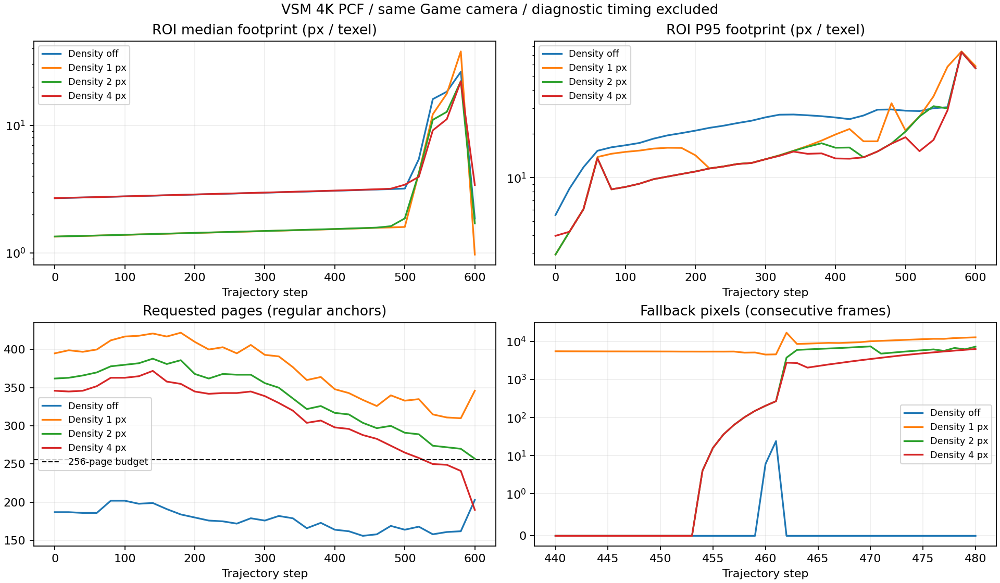

# VSM：密度对照与缺页恢复实测

日期：2026-09-06。接续 [Phase 0](VSMPhase0Findings.md)，完成同一 Game 相机轨迹的四组 4K PCF 对照。**保持 Screen Density 默认关闭；target=1/2/4 px 均未通过当前 256 页预算。原配置第 460–461 步的局部未映射回退，应单独追踪页面请求与生效帧序列。** 本轮增加采集和分析工具，没有修改生产选层、分配器、过渡权重或页预算。

## 对照条件与数据

沿用户选择的当前 Perf-Camera，从 (0.02020285, 7.66298294, -2.43060470) 固定朝向斜移世界坐标 (2,0,2)。1920×1080、FOV=60、60 帧预热、601 个姿态；4K PCF、First Level=1、Transition=0.2、LOD bias=0、Max Distance=150、denoise off、256 个物理页、9 个 clipmap 层。场景和光源快照保存于各 run.json，D3D12 debug 启动标记为 false。

每组保留每 20 步的 31 个常规锚点，并在 440–480 步逐帧采集，共 69 组中心 256×256 ROI。四种诊断是选层/过渡、实际纹素足迹、缺页/阴影一致性、密度策略约束。原始 RGBA32F 使用无损 gzip；详细模式不保存全帧 PNG，实际 Resolve 阴影仍保留在 mode 5 通道中。

| 配置 | 原始数据 | 姿态 / 快照 | 请求页范围 | 有溢出的采样点 | 溢出页范围 |
| --- | --- | ---: | ---: | ---: | ---: |
| Density off | [003649](Experiments/Quality/20260906_003649_23e50056/run.json) | 601 / 69 | 153–203 | 0 / 69 | 0 |
| Density on，1 px | [003757](Experiments/Quality/20260906_003757_47bf15c8/run.json) | 601 / 69 | 310–422 | 69 / 69 | 54–166 |
| Density on，2 px | [004246](Experiments/Quality/20260906_004246_a9cad44f/run.json) | 601 / 69 | 257–388 | 69 / 69 | 1–132 |
| Density on，4 px | [004758](Experiments/Quality/20260906_004758_14d022a4/run.json) | 601 / 69 | 190–372 | 65 / 69 | 0–116 |

以上是 69 个采样点的全局页计数范围，不代表 601 帧的完整计数时序。resident 包含缓存保留页，不应直接当成本帧需求数。

四组均 completed、无丢采；全部姿态的 VSM 活跃、参数与相机检查通过。四组 601 个位置、旋转、GPU VP 矩阵完全一致，场景/光源快照相同，仅密度开关和目标值变化；440–480 对应连续 41 个 Unity 帧，没有为等待读回而重复相机姿态。Density off 的 31 个常规锚点与上一轮稀疏复跑比较，93/93 个原始通道文件解压后逐字节相同。

常规锚点和加密窗口分别统计，避免第 460 步附近在总体指标中获得额外权重。[机器可读比较](Experiments/DensityComparison_20260906/comparison.json)和各目录的 quality-audit.json 可复核下列数字。

## 密度策略：局部变细，但预算与稳定性未通过

| 配置 | 常规锚点 ROI 回退像素占比 | 相对 off 实际足迹更小的配对像素 | 实际足迹更大的配对像素 |
| --- | ---: | ---: | ---: |
| Density off | 0.00030% | — | — |
| 1 px | 13.190% | 75.563% | 2.374% |
| 2 px | 5.318% | 66.295% | 4.515% |
| 4 px | 1.178% | 20.270% | 22.893% |

回退比例以 31 个常规 ROI 的表面像素为分母；足迹比较仅使用同一姿态、同一屏幕像素、双方足迹有效的样本，变化阈值为 0.1%。足迹是局部接收面微分下的较大轴长度，不是严格最大奇异值上界，也不是最终画面质量评分。末段相机贴近几何时 P95 很大，不能把全部高值归因于选层错误。

1 px 确实让大量像素采样更细，但所有采样点都超预算；2 px 仍全部超预算。4 px 只有 4 个采样点不溢出，同时更大足迹的配对像素多于更小足迹的像素，不能作为这一轨迹的默认修复。

密度目标也受几何覆盖限制。例如 1 px 的第 0 步，65,536 个 ROI 像素中有 55,425 个受更细投影覆盖约束，1,947 个期望 LOD 比配置的最细层还细；第 300 步分别为 53,628 和 13,153。这两个集合可以重叠。应分别检查 preferred 选层的覆盖限制与 sampled 选层的驻留降级，不能承诺开启 1 px 后实际采样就达到 1 px。



## 原配置：短暂未映射回退

Density off 的密集窗口里，仅以下两步出现 ROI 缺页；其余 39 步均为 0：

| 步数 | 缺页 / 回退像素 | resident / requested / new / overflow | preferred → sampled |
| --- | ---: | --- | --- |
| 460 | 6 / 6 | 256 / 158 / 4 / 0 | 2→3、3→4 |
| 461 | 24 / 24 | 256 / 163 / 5 / 0 | 1→2、2→3 |
| 462 | 0 / 0 | 见原始计数 | 无回退 |

这些像素缺页 mask 都是 unmapped=1，没有 dirty、ownership 或 out-of-map 位；回退像素没有二次过渡混合。该证据支持先检查新暴露页面的请求/驻留时序，不能据此认定同一个页面连续缺失了两帧：目前没有记录缺失 page ID。

代码路径也区分了两类原因：

- [CSMShadowPass.cs](../Runtime/RenderPass/Core/CSMShadowPass.cs) 向分配器传入 frameIndex−1 的反馈帧；HasReceiverFeedbackForFrame 检查同一相机上一帧反馈。这与新暴露接收面先回退、后得到驻留的现象一致，尚不是对每个缺失页面的因果证明。
- [CSMShadowResolve.compute](../Shaders/Core/Private/CSMShadowResolve.compute) 的 MarkVSMReceiverPage 已覆盖一纹素 halo（页角最多四页）；ResolveVSMReceiver 已请求完整 fallback 层链，并避免 fallback primary 再次混合。诊断重放不写反馈。
- [VSMReceiverQuality.hlsl](../Shaders/Core/Private/VSMReceiverQuality.hlsl) 分离了密度目标和投影覆盖约束。全局 256 页上限仍约束最后的实际驻留；本轮没有改变这些规则。

## 下一步实施顺序

1. **质量：追踪 off 的 460–461 步缺失页面。** 在有界诊断中记录虚拟 page ID、层/投影代次、首次请求帧、分配帧、dirty 清除与首次有效采样帧，区分首次暴露、滚动换主与淘汰。再决定是否需要运动预测请求或更早的当帧需求阶段；不用扩大过渡带掩盖缺页，也不直接扩大 halo 增加请求压力。
2. **密度：先制定需求与预算方案。** 保留完整 fallback 和 terminal/intermediate 保护语义，拆分按层请求、覆盖限制及被预算拒绝的页面，再单独评估需求优先级或预算实验。1/2/4 px 本轮均不进入默认候选；若增大页池，显存、清理、分配和光栅成本必须成套重测。
3. **性能：按既定 A1→A2→A3 推进。** 满池快速路径、并行 snapshot、确定性请求压缩分别与原分配器比较状态及计时。质量采集与正式性能基线互斥，性能运行使用 Manual 重绘；精确 Game 全帧 GPU 归属仍需独立验证。诊断轨迹耗时不能当作性能结果。

两层完整驻留、足迹合理时仍存在的亮暗断阶，才进入 bias/filter/transition 端点验证。本轮没有认证原动图问题已修复，也没有完成原墙面六档质量矩阵、camera cut 或动态 caster 验收。

## 采集实现、复跑与验证

[VSMQualityReproduction.cs](../Editor/Tools/VSMQualityReproduction.cs) 增加四个 Detailed Capture 菜单，位于 **Tools > VividRP > Diagnostics**：Density Off、Density On（1 px）、Density Target 2、Density Target 4。进入 Play Mode 并保持当前 Game view 可见后运行；停止使用 **Stop Quality Reproduction**。既有稀疏全帧 PNG 入口仍可用。

每个详细快照独占预分配读回存储及回调，连续帧不会覆盖仍在使用的缓冲。完整 69 组四通道共预留 276 MiB 原始 CPU 数据，另有 GPU 诊断输出；gzip/I/O 位于 Editor update，四组完整运行的压缩文件每轮约 39–69 MiB。普通采集中不等待 GPU、不固定停留在某个姿态；仅结束/中断清理时等待在途读回，再保存并释放资源。这些诊断开销均不属于性能基线。

[密集中断实测](Experiments/Quality/20260906_005752_a7e61cd2/run.json)：开始后 18.5 秒停止，状态 interrupted，保留 463 个姿态和 45 组快照（包括连续 440–462），无丢采、无状态为 queued 的残留。新资源元数据记录实际容量 256、层数 9；前四个原始 run.json 保持原样，未回填新增字段。已现场核验 timeScale=1、captureDeltaTime=0、targetFPS=−1、vSync=0、background=false、相机起始姿态恢复；退出 Play Mode 后临时质量 Volume 和纹理数均为 0。

复核命令（从包目录执行）：

```powershell
python Roadmap~/Experiments/analyze_quality.py Roadmap~/Experiments/Quality/<run-id>
python Roadmap~/Experiments/compare_density.py Roadmap~/Experiments/Quality/20260906_003649_23e50056 Roadmap~/Experiments/DensityComparison_20260906 Roadmap~/Experiments/Quality/20260906_003757_47bf15c8 Roadmap~/Experiments/Quality/20260906_004246_a9cad44f Roadmap~/Experiments/Quality/20260906_004758_14d022a4
```

Runtime、Editor、Editor.Tests 的 Roslyn 编译通过，Unity Console 无错误。直接提取实际采样调度实现的独立 .NET probe 验证 69 个唯一采样点、41 个连续密集姿态和边界，100,000 次预热后调用分配 0 字节。完整/中断原始通道的长度与有限值检查通过，验证记录见 [validation.json](Experiments/DensityComparison_20260906/validation.json)，文件摘要见 [manifest.json](Experiments/manifest.json)。

Unity Editor 保持打开，因此未启动 Unity Test Framework；请手动运行 `VSMBaselineRecorderTests`（含密集调度回归）。调度 probe 不替代所有渲染线程的 Unity Profiler 分配检查。
